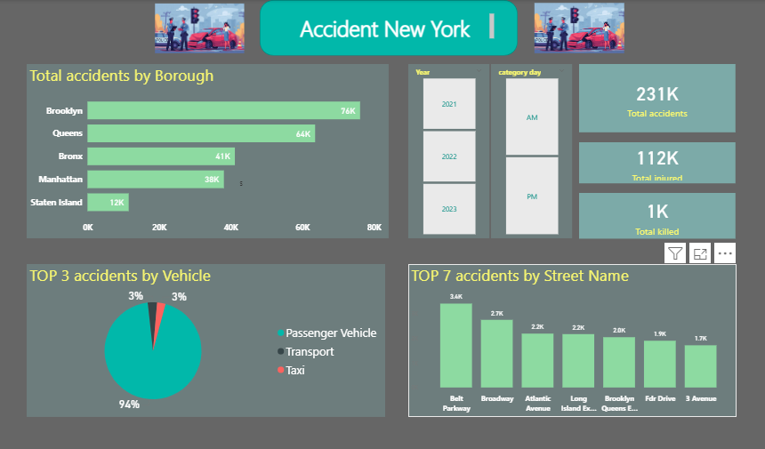
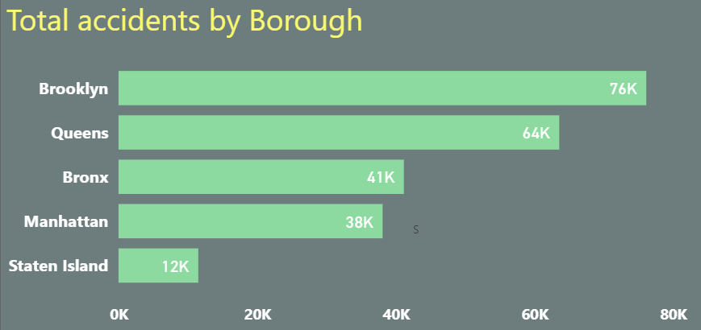
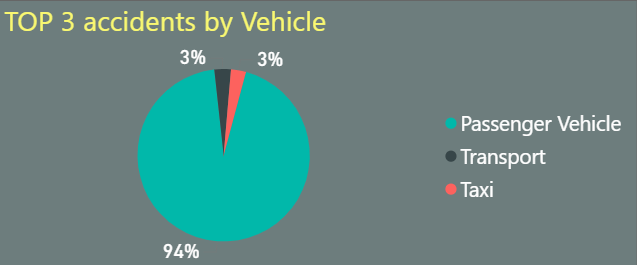
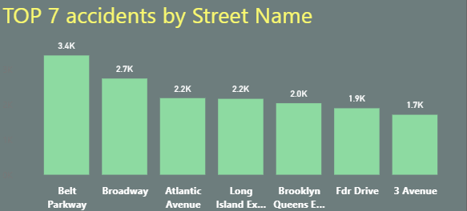

# accident-new-york_data_analysis
data analysis project using Power Bi to explore accident new york
## Data source :
from kaggel 
## Tools used :
Power Bi
## Project Question : 
Which location , times and conditions are associated with the highest number of accidentsin new york city ??
## Explore data :
the data contains 238422 rows and 19 columns 
## Clean data :
1- unimportant columns were removed from the analysis 

2- removed errors 

3- removed duplicate data 

4- each column was converted to a number , data or text format depending on the column and its contents

5- prepared the dataset for analysis 
## data analysis :

                                                         Dashboard
                                                         

brooklyn and queens have the highest number of accidents

passenger vehicles are involved in the majority of accidents

the most accident-prone roads are belt parkway , followed by broadway

key insight :

1- accidentsare higher in the evening (140k) compared to the morning(90)

2- accidents in 2023 dropped significantly to less than a quarter compared to 2021 and 2022

3- are the high accident rates in brooklyn and queens due to poor regulations or other factors ??

4- in the high rate of accidents involving  passenger vehicles a coincidence or due to other reasons??

5- are the top accident-prone streets due to poor road management or other causes ??
